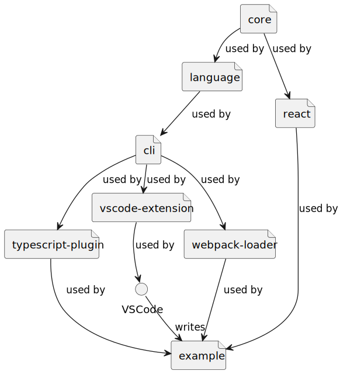

# Ecchi!

A domain-specific language for attribute-based access control.

## Example usage

In short:

> Define a hierarchy of access rules and check if a user has permissions to act on a resource.

Long version: **The project is still work in progress.**

1. define a hierarchy of access rules with its own domain-specific language
2. ???
3. profit

## Terms

* _concepts_ are equally-shaped compounds of data
  * concepts can inherit from other concepts
* _users_ are persons or identities - concepts whose access to subjects needs to be controlled
* _subjects_ are resources like business objects, API endpoints etc.
* _actions_ on subjects are the possible manipulations you can trigger as a user, when you have the right roles or permissions
  * actions can include other actions - they are modeled as a inheritance tree, like concepts are
* _roles_ can be seen as groups of users, each user can have multiple roles. A role cannhave certain permissions on actions for a certain subject
* _permissions_ reflect what actions a user is able to perform on subjects
* _access rules_ define access between users and subject actions - you can allow and forbid actions

## Contribution notes

For install, build and test simply use:

```bash
npm install
npm run build
npm test
```

### Packages



* `core` - the domain around access control
* `language` - the syntax and semantics of the access control language
* `cli` - a command-line interface for the transpiler
* `react` - visual components & hooks for React
* `typescript-plugin` - plugin for better TypeScript support
* `vscode-extension` - extension with language editor support
* `webpack-loader` - loader for Webpack
* `example` - example usage of the language

## Why is this language called „Ecchi!“?

From [Wikipedia](https://en.wikipedia.org/wiki/Ecchi):

> Ecchi (エッチ, etchi) is a slang term in the Japanese language for playfully sexual actions. As an adjective, it is used with the meaning of "sexy", "dirty" or "naughty"; as a verb, ecchi suru (エッチする or as a noun, it is used to describe someone of lascivious behavior. It is softer than the Japanese word ero (エロ from Eros or "erotic"), and does not imply perversion in the way hentai does.

In this context, it functions as a noun, specifically referring to a scene from the OVA and manga series [3x3 Eyes](https://en.wikipedia.org/wiki/3%C3%973_Eyes). In this scene, the main character Yakumo inadvertently touches Pai's intimate area, prompting her to shout "Ecchi!" at him and slap him in the face.

Here is some illustration from the Manga:


As a result, this library is about protecting the private parts of your application ;-).

## License

MIT 2024 by Markus Rudolph
